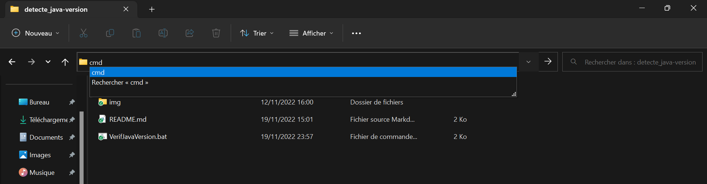

# Script permettant de comparer deux fichiers ou plusieurs dossiers

1. Comparer deux fichiers
    * Lancement du script
        * Interface graphique Windows
        * Terminal Windows
2. Comparer plusieurs dossiers
    * Lancement du script
        * Interface graphique Windows
        * Terminal Windows

## 1. Comparer deux fichiers
### Lancement du script
Pour lancer le script, il existe deux solutions, la première via l'interface graphique de Windows et la deuxième via un terminal (invite de commande/CMD). Il n'y a aucune réelle différence entre les deux méthodes si ce n'est que c'est plus rapide de passer par l'interface graphique Windows.

#### Interface graphique Windows
Après l'avoir téléchargé double-cliquer sur le script puis suivez les instruction qui vous serons données par le script.

#### Terminal Windows
Après avoir téléchargé le script, ouvrez le gestionnaire de fichier dans le répertoire où se trouve se dernier puis écrivez dans la barre en haut cmd ou powershell. Il est conseillé d'ouvrir un CMD.

Illustration pour ouvrir un cmd ou un powershell

Si vous ouvrez powershell écrivez `./compareDeuxFichiers.bat [argument]` dans ce dernier. Si vous ouvrez un cmd écrivez `compareDeuxFichiers.bat [argument]`

Pour lancer le script avec et des arguments il faut écrire
`compareDeuxFichiers.bat "cheminFichier1/nomFichier1.extention" "cheminFichier2/nomFichier2.extention"`.
tout les arguments après le deuxième seront ignoré.
Pour le lancer sans argument il faut simplement écrire `compareDeuxFichiers.bat` puis suivre les instructions données par le script

## 2. Comparer des dossiers
### Lancement du script
Pour lancer le script, il existe deux solutions, la première via l'interface graphique de Windows et la deuxième via un terminal (invite de commande/CMD). Il n'y a aucune réelle différence entre les deux méthodes si ce n'est que c'est plus rapide de passer par l'interface graphique Windows.

#### Interface graphique Windows
Après l'avoir téléchargé double-cliquer sur le script puis suivez les instruction qui vous serons données par le script.

#### Terminal Windows
Après avoir téléchargé le script, ouvrez le gestionnaire de fichier dans le répertoire où se trouve se dernier puis écrivez dans la barre en haut cmd ou powershell. Il est conseillé d'ouvrir un CMD.

Illustration pour ouvrir un cmd ou un powershell

Si vous ouvrez powershell écrivez `./compareDossiers.bat [argument]` dans ce dernier. Si vous ouvrez un cmd écrivez `compareDossiers.bat [argument]`

Pour lancer le script avec et des arguments il faut écrire `compareDossiers.bat "cheminDossier1" "cheminDossier2" "cheminDossier3"`
Il est bon de noter que vous pouvez comparer autant de dossiers que vous voulez mai plus il y en aura plus le traitement prendra de temp.
Pour le lancer sans argument il faut simplement écrire `compareDossiers.bat` puis suivre les instructions données par le script
